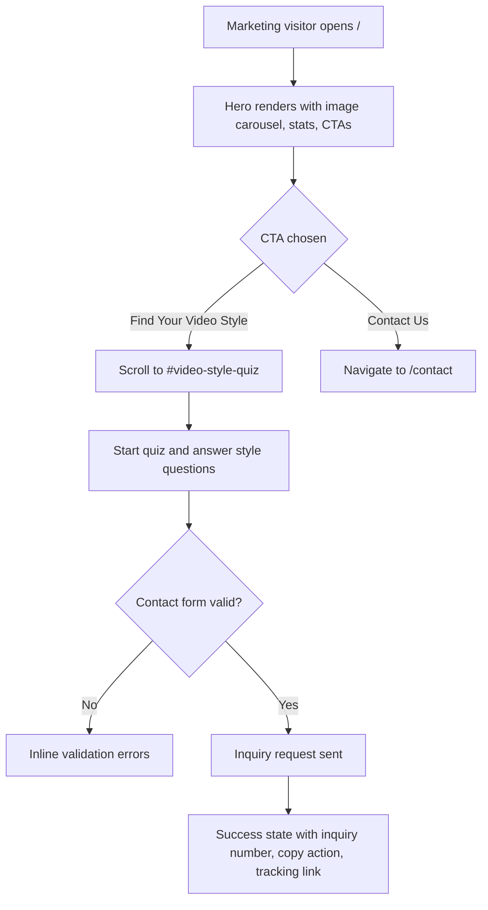
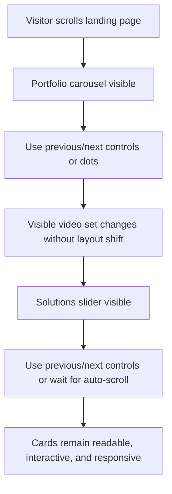
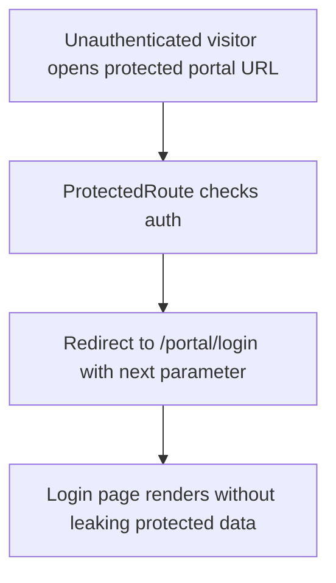
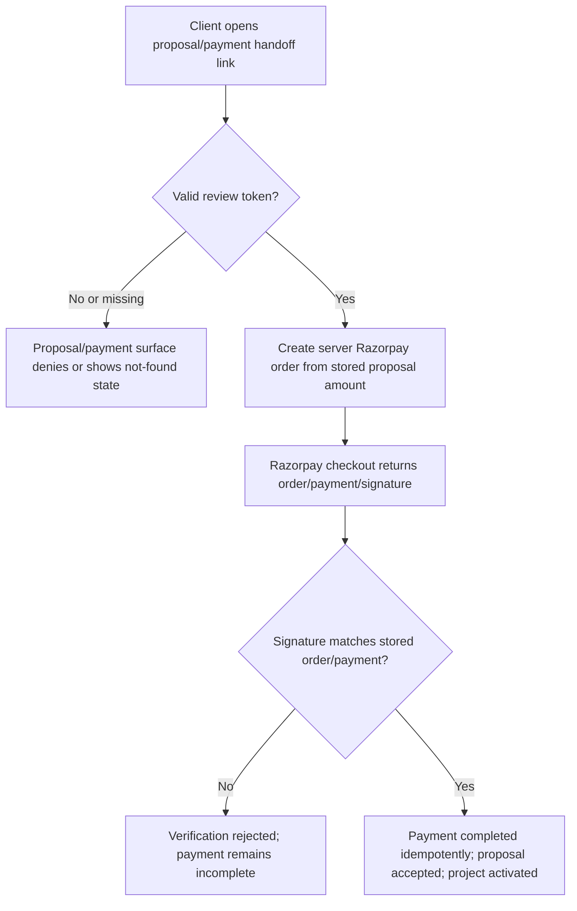
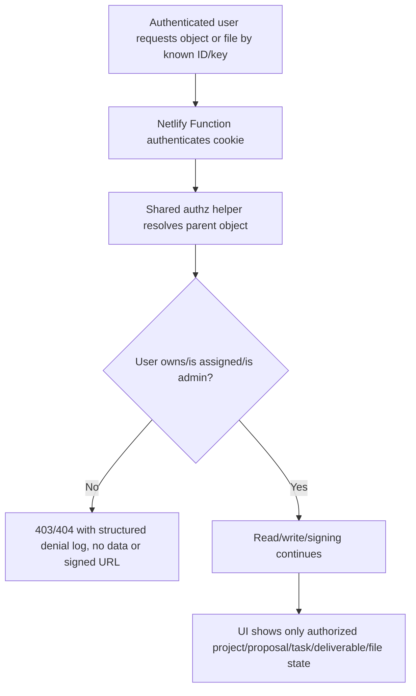

# Dogfood Report - security-review-full

> Diff-scoped browser QA of `security-review-full` vs `main`. Generated by `/ce-dogfood-beta` on 2026-06-05.

## Diff Summary

- Landing page visuals changed across the hero, shared landing buttons, portfolio carousel, solutions slider, process timeline, footer/header, and quiz/contact success surfaces.
- New landing assets were added under `public/images/lp/` and `public/images/motionify-studio-web.png`.
- Portal/API security hardening added shared role normalization, object-level authorization helpers, Razorpay checkout signature verification, stricter proposal review compatibility, and validation result typing.
- Payments now bind verification to server-created Razorpay orders and reject mismatched orders, duplicate provider payments, and invalid signatures.
- Files, attachments, deliverables, comments, projects, tasks, activities, notifications, and invitations now resolve parent-object access before reads/writes or R2 signing.
- Deployment docs now include security rollout checks for Razorpay env vars, proposal token compatibility, R2 smoke tests, denial logs, and historical payment audit.

## Personas

No `STRATEGY.md`, `VISION.md`, or persona docs were present. Personas inferred from the product and diff:

- **Marketing visitor** - wants to understand Motionify's video offering quickly and decide whether to start the quiz or contact the studio.
- **Prospective client** - wants to complete the quiz, submit an inquiry, track it, review a proposal, and pay safely.
- **Authenticated client** - wants project, payment, deliverable, comment, notification, and file access to be limited to their own work.
- **Internal support/admin** - wants broad operational visibility without accidentally exposing data to ordinary users.
- **Assigned team member** - wants access to assigned project work, but not client payment initiation or unrelated client data.

## Flows Tested

## Test Matrix & Results

| # | Flow | Journey / Scenario | Status | Issue | Fix | Commit |
|---|------|--------------------|--------|-------|-----|--------|
| 1 | Landing hero | Desktop `/` renders new hero imagery, stats, and CTAs without console/page errors | Pass | Hero H1, CTA hrefs, stats, and new images loaded; no horizontal overflow; screenshot `docs/dogfood-reports/screenshots/scenario-01-landing-desktop.png` | - | - |
| 2 | Landing hero | Mobile `/` renders hero without overlap or clipped CTA text | Pass | 390px viewport: H1 and CTAs fit, document `scrollWidth` equals viewport, screenshot `docs/dogfood-reports/screenshots/scenario-02-landing-mobile.png` | - | - |
| 3 | Quiz inquiry | Hero "Find Your Video Style" scrolls to quiz, quiz answers advance, validation errors show for incomplete contact form | Pass | CTA scrolled to quiz, five answers advanced to recommendation, contact submit without project details showed inline error; screenshot `docs/dogfood-reports/screenshots/scenario-03-quiz-validation.png` | - | - |
| 4 | Quiz inquiry | Completed quiz/contact path reaches success screen or a clear provider/server error without losing entered state | Blocked (needs human verify) | Initial retry showed form state preserved after function 500; after local JWT fix, Netlify function builder failed with `no space left on device` in `/private/var/.../T`, preventing full inquiry submit verification | - | - |
| 5 | Portfolio | Desktop portfolio carousel next/previous/dots rotate visible videos and keep labels/iframes usable | Pass | Initial videos `Live Action/Animation/Mixed Media`; next shifted to `Animation/Mixed Media/Motion Graphics`; dot `Motion Graphics` showed expected wrapped set; screenshot `docs/dogfood-reports/screenshots/scenario-05-portfolio-desktop.png` | - | - |
| 6 | Portfolio | Mobile portfolio carousel controls are visible, tappable, and do not cause horizontal page overflow | Pass | 390px viewport: previous/next controls are visible 40px targets, next rotates visible titles, no document overflow; screenshot `docs/dogfood-reports/screenshots/scenario-06-portfolio-mobile.png` | - | - |
| 7 | Solutions | Desktop/mobile solutions slider controls and auto-scroll keep cards readable and interactive | Pass | Desktop controls are visible 36px targets and move `#solutionsTrack`; mobile controls are visible, next advances scroll position, cards remain readable, and document `scrollWidth` equals viewport; screenshots `docs/dogfood-reports/screenshots/scenario-07-solutions-desktop.png` and `docs/dogfood-reports/screenshots/scenario-07-solutions-mobile.png` | - | - |
| 8 | Portal auth | Unauthenticated `/portal/projects`, `/portal/admin/payments`, and deliverable deep links redirect to login with `next` | Pass | `/portal/projects`, `/portal/admin/payments`, and `/portal/projects/fake-project/deliverables/fake-deliverable` all redirected to `/portal/login` with the expected `next` parameter and rendered only the login screen; screenshot `docs/dogfood-reports/screenshots/scenario-08-portal-projects-login.png` | - | - |
| 9 | Proposal/payment public | Missing/invalid proposal/payment handoff tokens fail closed without rendering sensitive proposal/payment data | Pass | Invalid proposal URL rendered "Proposal Not Found"; invalid payment URL rendered "Payment Not Found"; neither exposed amount/client details or payment actions; screenshots `docs/dogfood-reports/screenshots/scenario-09-invalid-proposal.png` and `docs/dogfood-reports/screenshots/scenario-09-invalid-payment.png` | - | - |
| 10 | Payment API | Browser-driven forged verification/missing provider config probes fail closed without completing payment | Fixed (unit verified; browser function server blocked) | Browser probes exposed module-load crashes when `RESEND_API_KEY` / Razorpay env vars are absent; Netlify's local wrapper served functions from the primary checkout path instead of this worktree, so the browser probe could not be rerun against the fixed worktree bundle | Made Resend and Razorpay clients lazy so handlers can return structured auth/config errors instead of throwing during import; added provider import regression coverage | Uncommitted |
| 11 | R2/API auth | Browser-driven unauthenticated R2/file/comment/project API probes return auth/denial responses, not signed URLs/data | Partial pass; comment probe covered by fix | Browser probes returned 401 for `r2-presign`, `project-files`, `deliverable-files`, `projects`, and `attachments`; `comments` hit the same stale primary-checkout `send-email` module-load issue | Same lazy Resend fix; regression test imports `comments` without provider env to prove the worktree module is safe | Uncommitted |
| 12 | Runtime/docs gates | Build and runtime-retirement checks remain green after dogfood fixes | Pass | `node --import tsx --test netlify/functions/_shared/__tests__/security-helpers.test.ts`, `git diff --check`, `npm run build`, `npm run verify:production-flip`, and `npm run verify:runtime-retirement` all passed | - | - |

## What Was Fixed

- Lazy provider clients for misconfigured/local payment and email paths:
  - Root cause: `new Resend(process.env.RESEND_API_KEY)` and `new Razorpay({ key_id: process.env.RAZORPAY_KEY_ID || '' })` ran at module import time. In local or provider-misconfigured environments, handlers crashed before auth, validation, or structured provider-config checks could run.
  - Fix: `netlify/functions/send-email.ts`, `netlify/functions/payments.ts`, and `netlify/functions/payment-handoff.ts` now construct provider clients only when a code path actually sends email or creates a Razorpay order.
  - Regression: `netlify/functions/_shared/__tests__/security-helpers.test.ts` imports `payments`, `payment-handoff`, `comments`, and `send-email` with optional provider env vars absent.
  - Commit: uncommitted.

## Console Errors

Scenario 1 observed development/external warnings only: React DevTools suggestion, YouTube iframe `web-share`/`allowfullscreen` warnings, and WebGL performance warnings. No uncaught page errors.

Payment/comment API probes in the browser also exposed stale Netlify local function wrappers pointing at `/Users/praburajasekaran/local-sites/motionify-gai/netlify/functions/...` instead of this worktree. The worktree modules were fixed and unit-verified, but the local browser function server could not be made to exercise those fixed bundles without editing the primary checkout.

## Human Verifications

- Razorpay real checkout and webhook delivery: pending human/external-provider verification.
- Real email delivery from inquiry/proposal/payment flows: pending human/external-provider verification.
- Local inquiry submit: blocked by Netlify Functions temp-space exhaustion while compiling functions.
- Real R2 object upload/download against production bucket: pending human/external-provider verification.
- Browser re-probe of fixed payment/comment functions: blocked by Netlify local wrapper resolving function sources to the primary checkout rather than this worktree.

## Decisions for a Human

- Free local disk before repeating full Netlify Functions browser dogfood. `/System/Volumes/Data` was at 100% with about 1.8 GiB available, and function compilation previously failed writing temp bundles under `/private/var/.../T`.
- Decide whether to adjust the local worktree/dev-server workflow so Netlify Functions reliably serves the current worktree instead of the primary checkout when testing isolated branches.

## Paper Cuts (By Persona)

- Prospective client: the inquiry submit path preserves form state on failure, but local provider/runtime errors do not produce a user-facing success or clear next step in this environment. Severity: medium; deferred because full submit is blocked by local function compilation/env.
- Internal support/admin: browser API dogfood from a worktree is misleading when Netlify serves function code from the primary checkout. Severity: high for QA confidence; deferred to tooling/workflow decision.
- Marketing visitor: landing, portfolio, and solutions interactions felt consistent across desktop/mobile. Severity: none found.

## Learnings

- Provider SDK clients should not be constructed at module import time when a handler can fail earlier on auth, validation, or provider configuration. Lazy construction keeps unauthenticated and misconfigured probes fail-closed and testable.
- In this repository, isolated Vite worktrees can still have Netlify Functions local wrappers resolve to the primary checkout. Browser dogfood needs a quick generated-wrapper path check before trusting function results.

## Final Status

Conditionally ready with blockers. The landing, carousel, protected-route, invalid-link, build, and helper/security regression scenarios passed. The local inquiry submit and browser re-probes for fixed payment/comment functions require human/environment follow-up because Netlify Functions hit disk pressure and then served stale primary-checkout function sources instead of the worktree.
