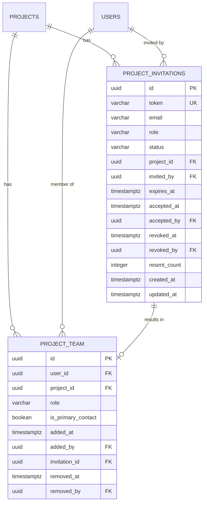

# Full Project Team Management

## Overview

Display actual project members in the Team tab and header avatars, enable inviting new members via email, removing members, and auto-populating teams when projects are created. Currently, the Team tab and header avatars show empty because `project.team` is hardcoded to `[]` in the API. The full team management spec exists in `/features/pending/team-management/` but has not been implemented.

## Problem Statement / Motivation

- The project detail page has a Team tab and header avatar section that show nothing
- The people icon (red arrow in screenshot) next to the project title has no onClick handler
- No `project_team` database table exists — the API returns `team: []` for every project
- Users cannot see who is working on their project, invite collaborators, or manage team membership
- This blocks client collaboration and project manager oversight

## Proposed Solution

Implement the full team management system as specified in `/features/pending/team-management/`, covering:

1. **Database** — Create `project_team` and `project_invitations` tables
2. **Auto-population** — When a project is created, auto-add the client user (primary contact) and the creator (super_admin/PM)
3. **API endpoints** — 7 REST endpoints for team CRUD and invitation management
4. **Display** — Populate Team tab and header avatars with real data
5. **Invite flow** — Token-based email invitations with 7-day expiry
6. **Remove flow** — Soft delete with validation (cannot remove self, primary contact, or last PM)
7. **Activity logging** — Log team events to the activities table

## Technical Approach

### Database

**Migration file:** `database/migrations/012_create_project_team_tables.sql`

Two tables from `/features/pending/team-management/04-database-schema.sql`:

```sql
-- project_team: who is on each project
CREATE TABLE project_team (
  id UUID PRIMARY KEY DEFAULT gen_random_uuid(),
  user_id UUID NOT NULL REFERENCES users(id),
  project_id UUID NOT NULL REFERENCES projects(id),
  role VARCHAR(50) NOT NULL,
  is_primary_contact BOOLEAN DEFAULT FALSE,
  added_at TIMESTAMPTZ DEFAULT NOW(),
  added_by UUID REFERENCES users(id),
  invitation_id UUID,
  removed_at TIMESTAMPTZ,
  removed_by UUID REFERENCES users(id),
  UNIQUE(user_id, project_id)  -- one membership per user per project
);

-- project_invitations: pending/accepted/expired/revoked invitations
CREATE TABLE project_invitations (
  id UUID PRIMARY KEY DEFAULT gen_random_uuid(),
  token VARCHAR(64) UNIQUE NOT NULL,
  email VARCHAR(255) NOT NULL,
  role VARCHAR(50) NOT NULL,
  status VARCHAR(50) DEFAULT 'pending',
  project_id UUID NOT NULL REFERENCES projects(id),
  invited_by UUID NOT NULL REFERENCES users(id),
  expires_at TIMESTAMPTZ NOT NULL,
  accepted_at TIMESTAMPTZ,
  accepted_by UUID REFERENCES users(id),
  revoked_at TIMESTAMPTZ,
  revoked_by UUID REFERENCES users(id),
  resent_at TIMESTAMPTZ,
  resent_count INTEGER DEFAULT 0,
  created_at TIMESTAMPTZ DEFAULT NOW(),
  updated_at TIMESTAMPTZ DEFAULT NOW()
);
```

**Backfill:** A data migration script to populate `project_team` for existing projects:
- Add each project's `client_user_id` as primary contact
- Add the proposal creator as team member (from `proposals` table if tracked)

### API Endpoints

All under `/netlify/functions/`:

| Method | Path | Description |
|--------|------|-------------|
| GET | `project-team/:projectId` | List active members + pending invitations |
| DELETE | `project-team/:projectId/:userId` | Soft-remove a member |
| POST | `invitations-create/:projectId` | Create invitation (existing endpoint, enhance) |
| POST | `invitations-resend/:invitationId` | Resend with new token |
| DELETE | `invitations-revoke/:invitationId` | Revoke pending invitation |
| GET | `invitations-verify?token=...` | Public: verify token validity |
| POST | `invitations-accept/:token` | Accept invitation (create team member) |

**GET project-team response shape:**
```typescript
{
  members: Array<{
    id: string;
    userId: string;
    name: string;
    email: string;
    avatar: string;
    role: UserRole;
    isPrimaryContact: boolean;
    addedAt: string;
  }>;
  pendingInvitations: Array<{
    id: string;
    email: string;
    role: string;
    status: string;
    createdAt: string;
    expiresAt: string;
  }>;
}
```

### Updating the Projects API

In `netlify/functions/projects.ts`, replace the hardcoded `team: []` with a JOIN query:

```sql
SELECT pt.id, pt.role, pt.is_primary_contact, pt.added_at,
       u.id as user_id, u.full_name, u.email, u.profile_picture_url
FROM project_team pt
JOIN users u ON pt.user_id = u.id
WHERE pt.project_id = $1 AND pt.removed_at IS NULL
ORDER BY pt.is_primary_contact DESC, pt.added_at ASC
```

### Auto-Population on Project Creation

In the project creation flow (payment webhook or manual creation):

```typescript
// After project INSERT, within the same transaction:
// 1. Add client as primary contact
INSERT INTO project_team (user_id, project_id, role, is_primary_contact)
VALUES ($clientUserId, $projectId, 'client', true);

// 2. Add creator (super_admin or PM who created the proposal)
INSERT INTO project_team (user_id, project_id, role, is_primary_contact)
VALUES ($creatorUserId, $projectId, $creatorRole, false);
```

### Frontend Changes

**`pages/ProjectDetail.tsx`:**

1. **Header avatars** (lines ~763-771) — Already renders `project.team.slice(0, 4)`. Once API returns real data, avatars appear automatically. Add onClick to the "+" button to navigate to Team tab.

2. **Team tab** (lines ~964-1032) — Already renders `project.team.map(...)` cards. Will auto-populate once API returns data. Add sections:
   - "Motionify Team" section (super_admin, project_manager, team_member roles)
   - "Client Team" section (client role members)
   - "Pending Invitations" section (from API response)

3. **Remove member** — Add dropdown menu on each team card with "Remove" option (with confirmation dialog). Respect permissions from PERMISSION_MATRIX.md.

4. **InviteModal** (`components/team/InviteModal.tsx`) — Already functional. Wire the header "+" button to open it. Add personal message field (designed but not implemented).

### Permission Rules

From `/docs/PERMISSION_MATRIX.md`:

| Action | Super Admin | Project Manager | Team Member | Client Primary | Client Team |
|--------|-------------|-----------------|-------------|----------------|-------------|
| View team | All projects | Assigned projects | Assigned projects | Own projects | Own projects |
| Invite anyone | Yes | Assigned projects | No | No | No |
| Invite client | Yes | Assigned projects | No | Own projects | No |
| Remove member | Yes | Assigned projects* | No | Client members only* | No |
| Resend/Revoke | Yes | Assigned projects | No | Own invitations | No |

*Cannot remove self, primary contact, or last PM.

### Activity Logging

Log to the existing `activities` table:

- `team_member_added` — When invitation accepted
- `team_member_removed` — When member soft-deleted
- `invitation_sent` — When invitation created
- `invitation_revoked` — When invitation revoked

## Acceptance Criteria

### Database & API
- [x] `project_team` table exists with correct schema and indexes
- [x] `project_invitations` table exists with correct schema
- [x] Existing projects backfilled with client user as primary contact
- [x] GET project-team endpoint returns members and pending invitations
- [x] Projects API populates `team` field from `project_team` table (no more `team: []`)

### Display
- [x] Header avatars show first 4 team members with "+N" overflow indicator
- [x] Clicking header people icon navigates to Team tab
- [x] Team tab shows members grouped by Motionify Team and Client Team
- [x] Each member card shows: avatar, name, email, role, primary contact badge
- [x] Pending invitations section shows email, role, status, expiry, with resend/revoke actions

### Invite Flow
- [x] "Add Member" button opens InviteModal (role-gated per permission matrix)
- [x] Invitation creates DB record and sends email via SES
- [x] Token-based acceptance link works for new and existing users
- [x] Duplicate invitation to same email on same project is prevented
- [x] Invitation expires after 7 days

### Remove Flow
- [x] Remove button on member card (role-gated per permission matrix)
- [x] Confirmation dialog before removal
- [x] Cannot remove self, primary contact, or last PM — show clear error
- [x] Soft delete sets `removed_at` timestamp, preserves historical data

### Auto-Population
- [x] New projects auto-add client user as primary contact
- [x] New projects auto-add creator (super_admin/PM) as team member
- [x] Auto-population happens atomically with project creation

### Activity
- [x] Team events logged to activities table
- [x] Activity tab on project shows team changes

## Dependencies & Risks

**Dependencies:**
- `users` table must exist (it does)
- `projects` table must exist (it does)
- Amazon SES configured for invitation emails (check if already set up)
- Existing `activities` table for logging (migration 011 — verify deployed)

**Risks:**
- **Email deliverability** — SES bounce handling not specified; defer to post-MVP
- **Primary contact transfer** — Spec says "cannot remove primary contact" but no transfer mechanism exists. Workaround: super_admin manually changes in DB. Create separate story for transfer feature.
- **Invitation token security** — Store tokens as plain text for MVP (rate limit verification attempts). Consider hashing for production hardening.
- **Race condition** — Two users accepting same invitation simultaneously. Mitigate with DB unique constraint on `(user_id, project_id)`.

## References & Research

### Internal References
- Feature spec: `/features/pending/team-management/` (7 files: user journey, wireframes, data models, schema, API, emails, tests)
- Permission matrix: `/docs/PERMISSION_MATRIX.md` (lines 331-350 for team management)
- Existing InviteModal: `/components/team/InviteModal.tsx`
- Project detail page: `/pages/ProjectDetail.tsx` (Team tab lines ~964-1032, header avatars lines ~763-771)
- Projects API: `/netlify/functions/projects.ts` (line 210: hardcoded `team: []`)
- Types: `/types.ts` (lines 29-47: User, ProjectTeamMembership interfaces)
- User management research: `.planning/phases/PROD-06-user-management/PROD-06-RESEARCH.md`

### Existing Components to Leverage
- `InviteModal` — Already handles email input, role selection, API call
- Team tab UI — Already has card layout, just needs data
- Header avatars — Already renders from `project.team` array
- Permission helpers — `isClientPrimaryContact()`, `isMotionifyTeam()` in `/utils/deliverablePermissions.ts`

### Test Plan
- 38 test cases documented in `/features/pending/team-management/07-test-cases.md`
- High priority: 24 tests (invitation creation, acceptance, removal permissions)
- API tests with Jest + Supertest
- E2E tests with Playwright for acceptance flow


