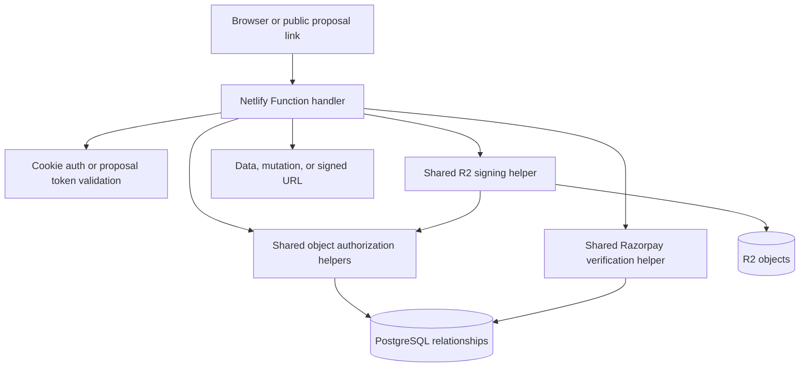

# Remediate Deep Security Scan Authorization and Payment Findings

## Summary

Remediate the June 2026 deep security scan by making server-side payment verification authoritative, adding reusable object-level authorization checks for Netlify Functions, locking file/R2 signing to authorized parent objects, and confirming the retired Next.js reference cannot expose legacy unauthenticated APIs.

This is cross-cutting security work. The implementation should favor shared authorization and payment primitives first, then convert endpoint groups onto those primitives with focused regression tests.

---

## Problem Frame

The scan reported 46 findings: 35 high severity and 11 medium severity. Most share the same root cause: handlers authenticate the caller or validate UUID shape, then use caller-controlled object IDs to read or mutate proposals, inquiries, projects, payments, tasks, comments, notifications, activities, attachments, or R2 keys without proving the caller is allowed to act on that specific object.

Two payment paths also accept browser-supplied Razorpay identifiers and signatures as sufficient proof of payment. That lets an attacker who has a pending payment ID or proposal review token mark a payment complete and trigger proposal acceptance or project activation without server-side signature verification.

The legacy `landing-page-new/` API findings are different: current repo context says that app is retained as a non-runtime reference, so remediation is to keep it out of production and prevent accidental reactivation rather than harden it as an active API surface.

---

## Requirements

**Payment integrity**

- R1. `payments` and `payment-handoff` verify actions must only complete a payment after server-side Razorpay signature verification against the order ID stored by the server for that payment.
- R2. Order creation must derive amount, currency, proposal, and payment type from trusted database state; client input must not be able to lower the amount, switch currency, or bind an order to another user's proposal.
- R3. Payment completion, proposal acceptance, and project activation must be idempotent and bound to the same payment, proposal, order, and caller/token context.

**Object authorization**

- R4. Every authenticated read or write that accepts an object ID must prove access to that object before returning data or mutating state.
- R5. Admin/support access, client ownership, primary contact access, and project team membership must be represented by reusable helpers rather than copied endpoint-specific SQL fragments.
- R6. Role names must be normalized so the codebase has one canonical team role value; authorization must not silently fall through because one module expects `team` and another expects `team_member`.
- R7. UUID format, object existence, token presence, and object-key naming conventions must not be treated as authorization controls.

**File and R2 access**

- R8. R2 presigned download URLs must be issued only after authorizing the caller against the parent deliverable, comment, project, proposal, or revision request.
- R9. R2 upload keys and attachment/file metadata records must be created only under authorized parent objects, and the signed key namespace must match that authorized parent.
- R10. File deletion and metadata mutation must check both the file record and parent-object authorization.

**Legacy runtime retirement**

- R11. `landing-page-new/` must remain non-runtime: root build/install/test/deploy paths must not execute or publish its API routes.
- R12. If any deployment path can still serve `landing-page-new/src/app/api/**`, those routes must be disabled, deleted, or protected before shipping this remediation.

**Verification**

- R13. Each remediated endpoint group must have negative authorization tests for a caller using another user's valid object ID.
- R14. Payment tests must cover forged signatures, mismatched order IDs, mismatched payment IDs, mismatched proposal/payment bindings, duplicate verification, and webhook/verify races.
- R15. Runtime-retirement verification must stay in CI or an equivalent deploy gate so the legacy API surface cannot return unnoticed.

---

## Key Technical Decisions

- KTD1. Centralize authorization in a shared Netlify Functions module: The findings are too broad for route-by-route patching. Add shared object access helpers and migrate handlers onto them so future endpoints inherit the same checks.
- KTD2. Make payments server-authoritative: Razorpay's current checkout guidance requires the server to generate an HMAC over the server's order ID and the returned payment ID, then compare it with the returned signature. The implementation must use the order ID stored in `payments.razorpay_order_id`, not a client-provided order as the source of truth.
- KTD3. Preserve tokenized public proposal flows, but narrow their authority: Proposal review tokens can authorize public proposal reading and the intended proposal payment handoff only for the proposal they were issued for. They must not authorize arbitrary payment completion or tokenless proposal reads.
- KTD4. Treat `landing-page-new/` as retired unless proven otherwise: The repo already has `netlify.toml`, `package.json`, and `scripts/verify-production-flip.mjs` controls for a single Vite runtime. The plan should verify and strengthen those controls instead of reviving a retired Next API surface.
- KTD5. Prefer failing closed over compatibility fallbacks on protected data: Existing compatibility paths that expose tokenless proposals or allow broad authenticated reads should return 403/404 unless a caller has explicit object access.
- KTD6. Use endpoint-group regression tests before broad rollout: The highest risk is accidentally locking out legitimate clients or team members. Tests should encode the intended access matrix before each endpoint group is migrated.

---

## High-Level Technical Design

The shared helpers should be small and explicit:

- `netlify/functions/_shared/authorization.ts` owns object access checks such as `requireProposalAccess`, `requireInquiryAccess`, `requireProjectAccess`, `requirePaymentAccess`, `requireTaskAccess`, `requireCommentAccess`, `requireDeliverableAccess`, and `requireNotificationAccess`.
- `netlify/functions/_shared/roles.ts` or an equivalent auth-local module owns role normalization and typed role predicates.
- `netlify/functions/_shared/payment-verification.ts` owns Razorpay checkout signature verification and payment/order binding checks.
- `netlify/functions/_shared/r2-access.ts` or targeted helper functions in `r2-presign.ts` own parent-object-to-key validation before signing.

---

## Implementation Units

### U1. Establish Shared Authorization and Role Primitives

- **Goal:** Create the reusable authorization layer that all endpoint fixes depend on.
- **Files:** `netlify/functions/_shared/auth.ts`, `netlify/functions/_shared/middleware.ts`, `netlify/functions/_shared/authorization.ts`, `netlify/functions/_shared/validation.ts`, `netlify/functions/_shared/schemas.ts`
- **Affected findings:** 3-18, 24, 26-33, 37-46
- **Approach:** Normalize the role model first. `auth.ts` currently defines `UserRole` as `super_admin | support | client | team`, while validation and several handlers check `team_member`. Pick the database/API truth, add a compatibility normalization boundary if existing tokens contain the old value, and expose predicate helpers such as `isAdminLike`, `isClient`, and `isTeamLike`.
- **Authorization helpers:** Add functions that query the relevant relationship and return either an authorized object row or a typed 403/404 result. Helpers should be parent-object aware: a task check resolves to its project, a comment check resolves to its proposal or task/project context, and a payment check resolves to its proposal/project.
- **Test files:** Add `netlify/functions/_shared/__tests__/authorization.test.ts` or, if the repo keeps function tests elsewhere during implementation, an equivalent `netlify/functions/**/__tests__` suite.
- **Test scenarios:**
  - Client can access their own proposal/inquiry/project but not another client's object.
  - Team member can access only projects they belong to.
  - Support/super admin can access support surfaces without object membership.
  - `team` and `team_member` inputs resolve consistently and do not bypass denial paths.
  - Missing object and unauthorized object responses do not leak sensitive row details.

### U2. Make Razorpay Verification and Order Creation Server-Authoritative

- **Goal:** Close forged payment completion and payment/project activation paths.
- **Files:** `netlify/functions/payments.ts`, `netlify/functions/payment-handoff.ts`, `netlify/functions/razorpay-webhook.ts`, `netlify/functions/_shared/proposal-payment-helpers.ts`, `netlify/functions/_shared/payment-verification.ts`, `netlify/functions/_shared/schemas.ts`, `e2e/payment-flow.spec.ts`, `e2e/proposal-to-project-flow.spec.ts`
- **Affected findings:** 1, 2, 6, 7, 15, 34
- **Approach:** For create-order, load the proposal and calculate amount/currency/payment type server-side. For verify, load the pending payment by `paymentId`, confirm it belongs to the authenticated caller or token-authorized proposal, compare `razorpayOrderId` to the stored `razorpay_order_id`, verify the signature using the server secret, and only then mark the payment completed.
- **Binding checks:** Verification must reject if the submitted payment ID is already bound to another order, if the stored order differs from the submitted order, if the payment row is not pending, or if the public handoff token belongs to a different proposal.
- **Webhook interaction:** Keep `razorpay-webhook.ts` as the server-authoritative fallback and ensure verify and webhook share the same idempotent project-activation helper.
- **Test scenarios:**
  - Forged `razorpaySignature` returns 400/401 and leaves payment pending.
  - Valid signature for a different order is rejected.
  - Authenticated user cannot verify another user's pending payment.
  - Public handoff token cannot verify a payment for another proposal.
  - Duplicate valid verification is idempotent and does not create duplicate projects.
  - Webhook and verify arriving in either order produce one completed payment and one project activation.

### U3. Lock Down Proposal and Inquiry APIs

- **Goal:** Remove broad authenticated access to commercial proposal data and inquiry PII.
- **Files:** `netlify/functions/proposals.ts`, `netlify/functions/proposal-detail.ts`, `netlify/functions/public-proposal.ts`, `netlify/functions/inquiries.ts`, `netlify/functions/inquiry-detail.ts`, `netlify/functions/comments.ts`
- **Affected findings:** 3-5, 24-26, 29, 30, 32, 35-37, 46
- **Approach:** Route every proposal and inquiry read/write through U1 helpers. Listing endpoints must scope results by role: support/admin can list broadly, clients see only owned/client-contact objects, and team members see only objects connected to their projects if that is a supported workflow.
- **Public proposal behavior:** Remove tokenless public proposal reads unless there is a separately approved compatibility exception. If an exception remains, make it explicit, time-boxed, and limited to non-sensitive fields.
- **Mutation rules:** Proposal creation/update should require support/admin or an approved internal role. Comment creation should require proposal access and should bind `uploaded_by`/author fields to the authenticated user, not request body fields.
- **Test scenarios:**
  - Authenticated client cannot list all proposals or inquiries.
  - Authenticated client cannot read, update, or comment on another client's proposal.
  - Support/admin can perform existing operational proposal and inquiry flows.
  - Public proposal read without a valid token is denied.
  - Valid proposal token can read only the intended public proposal shape.
  - Proposal creation for an arbitrary inquiry is denied for non-internal users.

### U4. Lock Down Project, Team, Invitation, Task, Deliverable, Activity, and Notification APIs

- **Goal:** Apply object authorization consistently across project workflow APIs.
- **Files:** `netlify/functions/projects.ts`, `netlify/functions/project-team.ts`, `netlify/functions/project-invitations-create.ts`, `netlify/functions/invitations-list.ts`, `netlify/functions/invitations-revoke.ts`, `netlify/functions/tasks.ts`, `netlify/functions/deliverables.ts`, `netlify/functions/revision-requests.ts`, `netlify/functions/activities.ts`, `netlify/functions/notifications.ts`
- **Affected findings:** 14, 16-18, 27, 31, 33, 38-41, 43-45
- **Approach:** Convert each handler to authorize the target project or parent object before list, read, create, update, delete, invite, revoke, comment, or activity operations. Requester identity should supply author/actor fields; request bodies should not be trusted for spoofable user IDs.
- **Role matrix:** Clients can manage only client-allowed project actions. Team members can act only within assigned projects and within their allowed operation set. Support/admin retains operational visibility. Invitation creation and revocation require project-manager authority on that project.
- **Notification rules:** Notifications should be scoped to `auth.user.userId` except support/admin operational paths that explicitly query another user.
- **Test scenarios:**
  - Team member cannot list tasks, deliverables, members, invitations, or activities for an unassigned project.
  - Client cannot mutate team-only deliverable fields or spoof task/comment authors.
  - Invitation create/revoke fails for users without project-manager authority on that project.
  - Notifications for another user cannot be read or marked by an ordinary authenticated user.
  - Project creation from an accepted proposal requires authorized proposal/payment context.

### U5. Lock Down Files, Attachments, and R2 Presigned URLs

- **Goal:** Ensure every signed URL and file metadata operation is tied to an authorized parent object.
- **Files:** `netlify/functions/r2-presign.ts`, `netlify/functions/attachments.ts`, `netlify/functions/project-files.ts`, `netlify/functions/deliverable-files.ts`, `netlify/functions/revision-requests.ts`, `netlify/functions/_shared/r2.ts`, `netlify/functions/_shared/schemas.ts`
- **Affected findings:** 8-12, 28, 42
- **Approach:** For downloads, resolve the key or file ID back to its database record and parent object, then call the relevant U1 authorization helper before signing. For uploads, derive the R2 key prefix from an already-authorized parent object instead of accepting arbitrary folder/key namespace input.
- **Key namespace checks:** A request to upload a comment attachment must be authorized for that comment's proposal/task context and must produce a key in that comment namespace. A project file upload must require project access and produce a key under that project. A deliverable or revision attachment must require deliverable access.
- **Test scenarios:**
  - Authenticated user cannot sign a comment attachment key from another proposal.
  - Authenticated user cannot create a project file record for another project.
  - Upload presign rejects arbitrary `projects/{id}/...` and comment namespaces not derived from an authorized parent.
  - Deliverable file metadata and signed URLs are denied for non-members.
  - Delete operations require both file ownership/record existence and parent access.

### U6. Verify and Strengthen Legacy Next API Retirement

- **Goal:** Prevent the reported unauthenticated Next API routes from being served in any production or preview runtime.
- **Files:** `landing-page-new/package.json`, `landing-page-new/README.md`, `landing-page-new/netlify.toml`, `netlify.toml`, `package.json`, `scripts/verify-production-flip.mjs`, `docs/production-flip.md`, `docs/netlify-deployment.md`
- **Affected findings:** 19-23, 34, 35
- **Approach:** Keep `landing-page-new/` as non-runtime reference unless the implementer discovers an active deploy target. Strengthen `scripts/verify-production-flip.mjs` to assert that no root script, Netlify config, CI workflow, or package lifecycle can build, serve, or publish `landing-page-new/src/app/api/**`.
- **Fallback if active:** If an external deploy or CI workflow still serves the Next app, disable the vulnerable API routes or route them to authenticated Netlify Functions before shipping.
- **Test scenarios:**
  - `npm run verify:runtime-retirement` fails if any root script invokes `landing-page-new`.
  - Retirement verification fails if `landing-page-new/.next` or `landing-page-new/node_modules` is present.
  - Retirement verification fails if Netlify publish/functions settings point at `landing-page-new`.
  - If a route guard is added, unauthenticated calls to legacy inquiry/proposal/payment/client/project APIs return 401/410.

### U7. Add Endpoint Authorization Regression Coverage and Security Review Fixtures

- **Goal:** Make the remediation durable with a reusable cross-object test matrix.
- **Files:** `e2e/admin-functional.spec.ts`, `e2e/portal-smoke.spec.ts`, `e2e/payment-flow.spec.ts`, `e2e/proposal-acceptance.spec.ts`, `e2e/comment-system.spec.ts`, `e2e/deliverable-review.spec.ts`, `playwright.config.ts`, `playwright.payment.config.ts`, new function-level test files under `netlify/functions/**/__tests__`
- **Affected findings:** all
- **Approach:** Add a small fixture model with two clients, two projects, at least one team member assigned to only one project, a support/admin user, pending/completed payments, deliverables, comments, attachments, activities, notifications, and invitations. Use it for endpoint-level negative tests and a few end-to-end happy paths.
- **Test scenarios:**
  - For each endpoint group, a valid ID from another user returns 403/404 and does not mutate state.
  - Existing legitimate client and team workflows still pass.
  - Payment happy path still creates an order, verifies a real test signature fixture, accepts the proposal, and creates one project.
  - R2 signing tests assert denial before signing, not just denial after URL use.
  - Legacy retirement verification remains part of the default pre-deploy check.

### U8. Rollout, Monitoring, and Data Cleanup

- **Goal:** Ship security fixes without losing visibility into compatibility breaks or historical payment state.
- **Files:** `docs/deployment-checklist.md`, `docs/netlify-deployment.md`, `netlify/functions/_shared/logger.ts`, `netlify/functions/razorpay-webhook.ts`, `netlify/functions/payments.ts`
- **Affected findings:** all payment and object-authorization findings
- **Approach:** Add structured denial logs with endpoint, object type, user ID, role, and correlation ID, but never sensitive object payloads. Add a short deployment checklist covering env vars, Razorpay secret availability, webhook secret availability, retirement verification, and smoke tests.
- **Historical payment audit:** After the fix, review recently completed payments that lack verified provider evidence or have inconsistent Razorpay order/payment binding. This may be an operational script or manual SQL checklist, not necessarily product code.
- **Test scenarios:**
  - Authorization denial logs include enough context for incident review without exposing proposal/payment details.
  - Missing Razorpay secret fails closed for verification endpoints.
  - Deployment checklist includes payment verification, runtime retirement, and representative portal smoke tests.

---

## Scope Boundaries

- **In scope:** Server-side authorization, payment verification, R2 signing authorization, legacy runtime retirement checks, and regression tests for the reported surfaces.
- **In scope:** Preserving legitimate client proposal review, payment handoff, project collaboration, deliverable review, and support/admin workflows.
- **Deferred:** A full RBAC redesign or database row-level security migration. The shared helper layer should not block a future RLS move, but this plan is an application-layer remediation.
- **Deferred:** Deleting `landing-page-new/` entirely. This plan only requires proving it is not a runtime surface or guarding it if that proof fails.
- **Out of scope:** Frontend redesign, payment-provider migration, and unrelated security hardening not tied to the scan findings.

---

## System-Wide Impact

This remediation changes the backend security contract for most portal APIs. Frontend clients that accidentally relied on broad reads or tokenless proposal access will start receiving 403/404 responses. That is intended for protected data, but implementation should update affected client flows so legitimate users keep working.

The payment flow becomes stricter: the client can still submit Razorpay checkout return fields, but the server decides whether they are valid and bound to the stored pending payment. Webhooks and optimistic frontend verification must remain idempotent because either may observe the successful payment first.

The file-access model also becomes parent-object based. R2 object keys should become implementation details, not bearer-like capabilities that any authenticated user can exchange for a signed URL.

---

## Risks & Dependencies

| Risk | Mitigation |
|---|---|
| Legitimate users lose access because existing relationship data is incomplete. | Add fixtures and run happy-path e2e coverage for client, team, and support/admin roles before migrating each endpoint group. |
| Existing JWTs contain the non-canonical team role value. | Normalize roles at auth boundary and document the compatibility window before removing old values. |
| Payment verify and webhook race create duplicate side effects. | Keep project activation in `netlify/functions/_shared/proposal-payment-helpers.ts` idempotent and test both arrival orders. |
| Legacy Next routes are assumed retired but still deployed elsewhere. | Strengthen `scripts/verify-production-flip.mjs`, inspect deployment config, and disable/guard routes if any active path exists. |
| Historical forged or inconsistent payments already exist. | Add operational audit steps after code remediation; do not silently trust historical completed rows that lack provider evidence. |

---

## Acceptance Examples

- AE1. Given client A is authenticated and knows client B's proposal UUID, when client A requests that proposal through `proposals` or `proposal-detail`, then the API returns 403/404 and no proposal fields are returned.
- AE2. Given a public proposal token for proposal A and a pending payment for proposal B, when the token holder submits verify fields for payment B, then verification fails and payment B remains pending.
- AE3. Given a pending Razorpay order stored for proposal A, when the browser submits a valid-looking signature for another order ID, then the server rejects it because the stored order binding does not match.
- AE4. Given team member A belongs to project A only, when they request tasks, deliverables, team members, files, activities, or invitations for project B, then the API returns 403/404.
- AE5. Given an authenticated user knows an R2 key for another proposal's comment attachment, when they request a presigned download URL, then no URL is generated.
- AE6. Given `landing-page-new/` is accidentally added back to a root build script, when runtime-retirement verification runs, then the check fails before deploy.

---

## Sources / Research

- Deep Security Scan report generated for commit `036c7bad5b62` on 2026-06-03 identified 46 reportable findings across payment verification, object authorization, R2 signing, and retired Next API surfaces.
- Existing runtime-retirement controls are documented in `docs/production-flip.md`, `docs/netlify-deployment.md`, `netlify.toml`, `package.json`, and `scripts/verify-production-flip.mjs`.
- Existing payment/webhook primitives are in `netlify/functions/payments.ts`, `netlify/functions/payment-handoff.ts`, `netlify/functions/razorpay-webhook.ts`, and `netlify/functions/_shared/proposal-payment-helpers.ts`.
- Existing auth and role primitives are in `netlify/functions/_shared/auth.ts`, `netlify/functions/_shared/middleware.ts`, and `netlify/functions/_shared/validation.ts`.
- Razorpay's current checkout documentation describes payment signature verification as a mandatory server-side step using HMAC SHA256 over the server-side order ID and the returned payment ID, compared to `razorpay_signature`: https://razorpay.com/docs/payments/payment-gateway/quick-integration/integration-steps/
