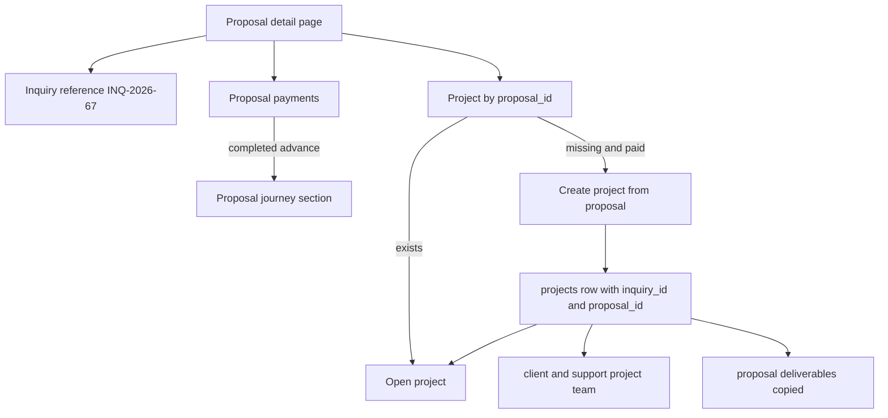
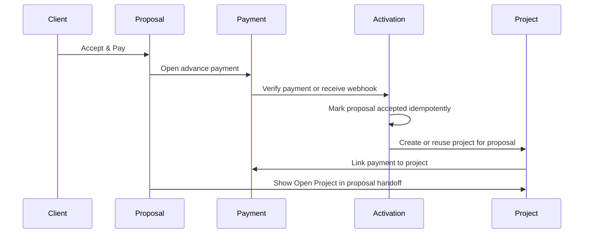

# feat: Proposal Project Handoff

## Summary

Show the post-acceptance project handoff inside the proposal experience so admins, support users, and clients can see the inquiry/proposal reference, payment state, and linked project in one journey. The backend already stores `inquiry_id`, `proposal_id`, and `project_id` relationships; this plan makes those relationships visible and reliable from the accepted proposal section.

---

## Problem Frame

Clients trust the proposal flow because payment, scope, and acceptance happen there. Today the backend mostly honors that model, but the UI does not present a complete handoff: accepted proposal pages do not give admin/support a clear create-or-open project action, the client accepted-state footer references missing derived state, and the generic project wizard does not expose proposal selection like `INQ-2026-67`. This creates a gap between the actual data model and the journey the client expects to track.

Prior payment-gated acceptance work established that successful advance payment is proposal acceptance and project activation. Razorpay’s webhook guidance reinforces that payment processing must remain idempotent because duplicate and out-of-order webhook events are expected.

---

## Requirements

- R1. Accepted proposal pages show a proposal journey section with the inquiry number, client, accepted status, advance payment status, and linked project state.
- R2. Admin and support users can create or open the project from the accepted proposal section without losing the proposal, contract, payment, or inquiry context.
- R3. Clients can open the project from the accepted proposal section after the completed advance payment creates or links the project.
- R4. Project creation from a proposal remains gated by a completed advance payment and never creates duplicate projects for the same proposal.
- R5. Project creation binds the project to the proposal and inquiry through persisted IDs while displaying the inquiry number, such as `INQ-2026-67`, as the client-facing proposal reference.
- R6. The project creation wizard supports choosing an accepted paid proposal by inquiry number and pre-fills proposal-derived project fields when used as a standalone admin path.
- R7. Existing payment verification, webhook, manual completion, and public payment handoff paths continue to use the same idempotent activation model.
- R8. The proposal-to-project flow has automated coverage for accepted, non-accepted, client, admin/support, duplicate-create, and standalone project-creation states.

---

## Key Technical Decisions

- **Payment remains the activation source of truth:** The proposal section should expose project setup state, not mark proposals accepted independently. This preserves the existing payment-gated acceptance model and avoids accepted-but-unpaid state.
- **Use inquiry number as the visible proposal reference:** The UI should say `INQ-2026-67` or equivalent because the codebase currently treats inquiry numbers as the client-facing proposal reference. Generated `PROJ-YYYY-NNN` remains the project identifier after creation.
- **Expose handoff state through real persisted relationships:** Proposal detail needs enough data to derive `completedAdvancePayment`, `linkedProjectId`, and project number from payments/projects rather than relying on local state. The current client accepted-state block references those values without defining them.
- **Make proposal-based project creation idempotent in every entry path:** The shared payment activation helper already checks for an existing project by `proposal_id`; the admin project API path should follow the same rule before inserting and should treat project, deliverable, team, inquiry, and payment updates as one activation transaction where possible.
- **Prefer extending the current proposal and project flows over adding a new lifecycle status:** Existing statuses already distinguish `sent`, `accepted`, and `converted`; the missing work is a visible handoff and reliable lookup, not a new state machine.

---

## High-Level Technical Design

---

## Implementation Units

### U1. Add Proposal Handoff State API Support

- **Goal:** Give proposal views a single reliable source for payment and project handoff state.
- **Requirements:** R1, R3, R5, R7.
- **Dependencies:** None.
- **Files:** `netlify/functions/proposal-detail.ts`, `lib/proposals.ts`, `shared/contracts/proposal.contract.ts`, `services/paymentApi.ts`, `e2e/proposal-to-project-flow.spec.ts`.
- **Approach:** Enrich proposal detail or add a narrow companion fetch so the UI can obtain completed advance payment state and the project linked by `proposal_id`. Include project ID and project number when present, while preserving existing authorization through `requireProposalAccess`.
- **Patterns to follow:** `netlify/functions/payments.ts` already joins payments to projects for access; `shared/hooks/useProjects.ts` maps `proposal_id` and `project_number` into client models.
- **Test scenarios:**
  - Accepted proposal with completed advance payment and existing project returns a linked project ID and project number.
  - Accepted proposal with completed advance payment and no project returns paid-but-not-created state.
  - Sent proposal with no completed payment returns no create/open project state.
  - Client request for another client’s proposal remains forbidden through the existing proposal authorization path.
- **Verification:** Proposal detail UI can render accepted paid, accepted unpaid, and project-linked states without undefined variables or extra client-side guessing.

### U2. Make Proposal-Based Project Creation Idempotent

- **Goal:** Ensure any admin/support create action from a proposal reuses an existing project or creates exactly one project.
- **Requirements:** R2, R4, R5, R7.
- **Dependencies:** U1.
- **Files:** `netlify/functions/projects.ts`, `netlify/functions/_shared/proposal-payment-helpers.ts`, `netlify/functions/_shared/schemas.ts`, `netlify/functions/_shared/__tests__/proposal-payment-helpers.test.ts`, `e2e/proposal-to-project-flow.spec.ts`.
- **Approach:** Keep `POST /projects` with `inquiryId` and `proposalId` as the proposal-based creation path, but add an existing-project lookup by `proposal_id` before insert. Require accepted proposal plus completed advance payment as today, and return the existing project when one is already linked.
- **Execution note:** Start with characterization coverage around duplicate create attempts before changing insert behavior.
- **Patterns to follow:** `acceptProposalAndCreateProject` checks `projects WHERE proposal_id = $1` before insert and links payments to the project; mirror that behavior for admin-triggered creation.
- **Test scenarios:**
  - First paid accepted proposal create inserts one project with `inquiry_id`, `proposal_id`, client user, support team, and deliverables.
  - Second create request for the same proposal returns the existing project instead of inserting a duplicate.
  - Accepted proposal without completed advance payment is rejected.
  - Sent proposal with completed or pending payment is rejected unless proposal acceptance has already been established by the payment path.
  - Missing inquiry or proposal returns the existing error shape without partial project writes.
- **Verification:** Repeated UI clicks, verify/webhook races, and manual admin attempts cannot create more than one project for the same proposal. Failed project creation attempts do not leave deliverables, team membership, or inquiry conversion partially written.

### U3. Render Accepted Proposal Handoff in Admin, Support, and Client Views

- **Goal:** Show one proposal-section journey surface with payment state and create/open project actions.
- **Requirements:** R1, R2, R3, R5.
- **Dependencies:** U1, U2.
- **Files:** `pages/admin/ProposalDetail.tsx`, `components/ui/design-system.tsx`, `e2e/proposal-to-project-flow.spec.ts`.
- **Approach:** Replace the current accepted-state footer with a section that works for admin/support and client roles. Admin/support see `Create Project` only when the proposal is accepted, advance payment is completed, and no project is linked; all roles see `Open Project` when a project exists. Clients without completed advance payment keep the payment CTA.
- **Patterns to follow:** The existing page header already displays the inquiry number; the admin payments page uses explicit link-to-project state and loading/error flags for project linking actions.
- **Test scenarios:**
  - Admin viewing accepted paid proposal with no project sees inquiry number, payment received state, and `Create Project`.
  - Admin viewing accepted paid proposal with a linked project sees `Open Project` and no duplicate create CTA.
  - Support user sees the same create/open behavior as super admin.
  - Client viewing accepted linked proposal sees `Open Project`.
  - Client viewing accepted proposal without completed payment sees `Proceed to Payment`.
  - Sent proposal never shows create project.
  - Create action failure keeps the user on the proposal and shows a recoverable error.
- **Verification:** Admin/support and client routes render the same journey facts while preserving role-specific actions.

### U4. Add Proposal Selection to Standalone Project Creation

- **Goal:** Let admin/support create a project from an accepted paid proposal through the existing project wizard when they start from `/projects/new`.
- **Requirements:** R2, R5, R6.
- **Dependencies:** U1, U2.
- **Files:** `pages/CreateProject.tsx`, `pages/NewProjectRouter.tsx`, `lib/api-config.ts`, `netlify/functions/proposals.ts`, `netlify/functions/projects.ts`, `e2e/proposal-to-project-flow.spec.ts`.
- **Approach:** Add a “Link to Proposal” selector that lists accepted paid proposals with inquiry number, client, company, and amount. Selecting a proposal should populate client, description, deliverables, total revisions, and review summary from proposal/inquiry data, then submit through the proposal-based project path rather than the direct project path. The listing must exclude proposals that already have a project unless the wizard is intentionally opening that existing project.
- **Patterns to follow:** `CreateProject` already uses API-backed client selection and the prior project-creation learning warns against UI-only project creation. Keep the direct project path available for work that does not originate from a proposal.
- **Test scenarios:**
  - Selector lists accepted paid proposals with inquiry-number labels such as `INQ-2026-67`.
  - Selecting a proposal pre-fills client, description, revisions, and deliverables.
  - Review step displays the inquiry/proposal binding before submission.
  - Submitting a linked proposal calls the proposal-based project path and opens or returns the created project.
  - Direct project creation without a proposal still works with a selected client and manual deliverables.
  - Unpaid or non-accepted proposals do not appear as selectable creation sources.
- **Verification:** `/projects/new` supports the requested inquiry-number selection while preserving the existing direct admin creation workflow.

### U5. Tighten E2E and Regression Coverage

- **Goal:** Convert the existing exploratory proposal-to-project checks into pass/fail coverage for the handoff behavior.
- **Requirements:** R1, R2, R3, R4, R6, R8.
- **Dependencies:** U1, U2, U3, U4.
- **Files:** `e2e/proposal-to-project-flow.spec.ts`, `playwright.config.ts`, `package.json`.
- **Approach:** Update mocks so accepted paid proposals can return both unlinked and linked project states. Replace console-only “feature gap” reporting with assertions for create/open visibility, duplicate protection, and proposal selector behavior.
- **Patterns to follow:** The existing spec already models `INQ-2026-67`, accepted vs. sent proposals, client vs. admin users, and the standalone project wizard.
- **Test scenarios:**
  - Accepted paid unlinked proposal shows `Create Project` for admin/support.
  - Create project action receives a persisted project response and changes the UI to `Open Project`.
  - Accepted paid linked proposal starts with `Open Project`.
  - Sent proposal hides create project.
  - Client sent proposal routes `Accept & Pay` to payment without direct proposal acceptance update.
  - Standalone project wizard shows proposal binding and prefilled review state.
- **Verification:** The proposal-to-project e2e spec passes with assertions rather than console-only gap reporting, or the implementer records any environment-specific blocker.

---

## Acceptance Examples

- AE1. Given proposal `INQ-2026-67` is accepted, has a completed advance payment, and has no linked project, when an admin or support user opens the proposal page, then the proposal journey section shows payment received state and a `Create Project` action.
- AE2. Given proposal `INQ-2026-67` already has a linked project, when any authorized admin/support/client opens the proposal page, then the proposal journey section shows `Open Project` and does not offer duplicate creation.
- AE3. Given a proposal is still `sent`, when any authorized user opens it, then no create-project action is shown.
- AE4. Given an admin starts a standalone project from the project wizard, when they choose `INQ-2026-67` from the proposal selector, then proposal client, deliverables, revisions, and description appear in the review step before creation.
- AE5. Given the same paid accepted proposal receives repeated project-create requests, when the backend handles them, then only one project exists for that `proposal_id` and all responses point to that project.

---

## Scope Boundaries

- Keep Razorpay payment provider behavior, payment signature verification, and public payment handoff semantics unchanged.
- Do not add a new proposal or inquiry lifecycle status.
- Do not replace the existing direct admin project creation path; add proposal binding alongside it.

### Deferred to Follow-Up Work

- A broader dashboard-level timeline that spans inquiry, proposal, payment, project, deliverable approvals, and final delivery.
- A database migration to store a separate display `proposal_number` if the product later wants a number distinct from the inquiry number.
- Admin alerting for paid proposals whose project activation failed after all idempotent retries.

---

## System-Wide Impact

This change crosses proposal authorization, payments, project creation, client navigation, and the admin project wizard. It should preserve the current access model: proposal access determines who can see the proposal handoff, project access determines who can open the created project, and payment completion determines whether project creation is allowed.

The most important integrity boundary is the transition from a paid accepted proposal to a persisted project. That boundary should remain server-owned, idempotent, and authorization-checked; the UI can request creation, but it should not infer success until the persisted project is returned.

---

## Risks & Dependencies

| Risk | Impact | Mitigation |
|---|---|---|
| Duplicate projects from repeated admin clicks or payment races | High | Check for existing `projects.proposal_id` before insert and return the existing project when present. |
| Partial project creation writes | High | Prefer a transaction around project, deliverable, team, inquiry, and payment-link updates in the proposal-based create path. |
| Stale proposal UI after create | Medium | Refresh handoff state after project creation and disable create while the request is pending. |
| Ambiguous numbering language | Medium | Display `INQ-2026-67` as the proposal/inquiry reference and reserve `PROJ-YYYY-NNN` for the created project. |
| Payment event retries or out-of-order delivery | High | Keep payment activation idempotent and avoid UI behavior that bypasses completed-advance-payment checks. |

---

## Operational Notes

No data migration is required for the visible proposal reference because `inquiries.inquiry_number`, `projects.inquiry_id`, `projects.proposal_id`, and `payments.project_id` already carry the relationship. If implementation discovers existing projects missing `proposal_id` or payments missing `project_id`, treat that as a data-repair follow-up rather than expanding this feature silently.

---

## Sources & Research

- `docs/brainstorms/2026-03-14-payment-gated-proposal-acceptance-brainstorm.md` established the payment-is-acceptance model.
- `docs/plans/2026-03-14-fix-payment-gated-proposal-acceptance-plan.md` planned the shared payment activation helper and backend guards.
- `docs/plans/2026-05-23-project-access-after-advance-payment-plan.md` planned project access after advance payment.
- `docs/solutions/integration-issues/project-creation-not-persisted-missing-api-call-SuperAdmin-20260221.md` documents the prevention rule that project creation UI must call a real API and persist client assignment.
- Razorpay webhook best practices document duplicate event handling, retry behavior, and idempotency requirements: https://razorpay.com/docs/webhooks/best-practices/
