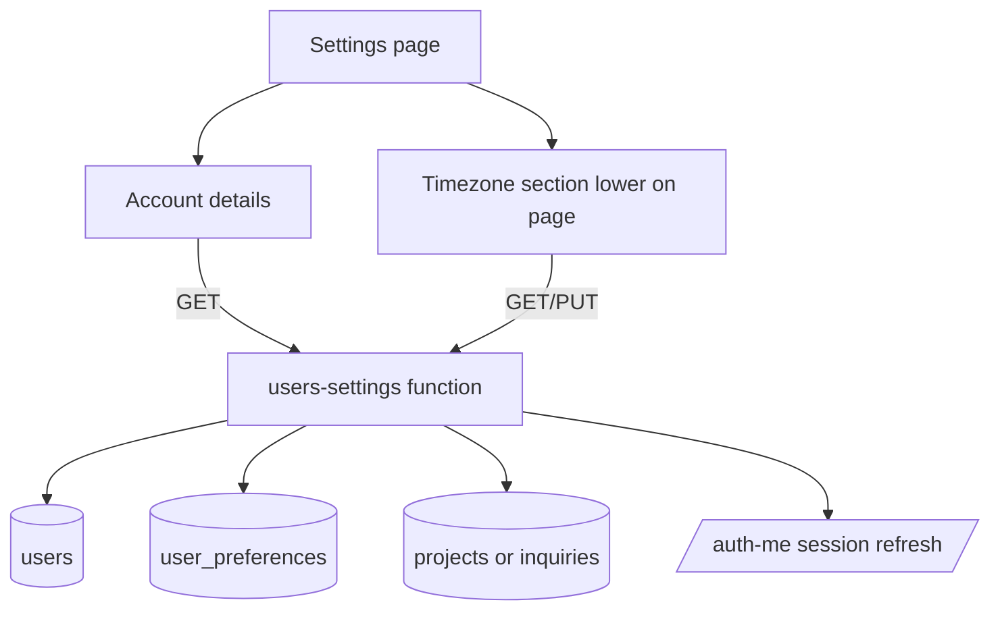

# fix: Replace settings notifications with account profile

## Summary

Replace the settings page notification controls with an account profile surface that shows the signed-in user's email, organization, and role, lets the user update only their display name, and keeps timezone as a lower page section that persists to `user_preferences.timezone`.

---

## Problem Frame

The current `/portal/settings` page is still centered on notification preferences, but the page does not show basic account identity and the email controls are no longer the desired product behavior. The app uses passwordless magic-link authentication, so password reset UI would be misleading unless the auth model changes. Timezone is visible today, but its backend update path is incomplete because `users-settings` validates `timezone` while its update allowlist omits it.

---

## Requirements

- R1. The settings page shows the authenticated user's email as read-only account identity.
- R2. The settings page shows organization name and role as prefilled, read-only fields.
- R3. The settings page shows an editable name field and persists successful changes to the authenticated user's `users.full_name`.
- R4. The timezone field remains on the settings page, appears lower than the account identity section, and persists to `user_preferences.timezone`.
- R5. Email notification options are removed from the settings UI, and application emails are treated as on by default with no user preference gate.
- R6. The page avoids password reset UI because the current authentication model is passwordless magic-link login.
- R7. Auth session and cached user state refresh after name or timezone changes so the sidebar, dashboard greeting, and future `/auth-me` reads stay consistent.

---

## Key Technical Decisions

- KTD1. Keep account settings on `pages/Settings.tsx` instead of creating a new route: `/portal/settings` is already linked from the layout and covered by smoke and accessibility tests.
- KTD2. Extend the authenticated settings backend rather than trusting client-side user data: `netlify/functions/users-settings.ts` already has auth, CSRF, CORS, rate limiting, validation, and user-scoped access.
- KTD3. Persist name in `users.full_name` and timezone in `user_preferences.timezone`: these are the existing sources used by magic-link auth and `/auth-me`; no new table is needed.
- KTD4. Treat organization as read-only derived account context: the `users` table has no organization column, so the backend should derive organization from the user's most relevant project joined to `inquiries.company_name`, then return `null` when no company name is available.
- KTD5. Remove notification preference enforcement from email send paths: leaving existing false preference rows in place would otherwise keep suppressing emails even after the UI controls disappear.
- KTD6. Do not add password reset behavior in this fix: `docs/AUTHENTICATION_SETUP.md` and `auth-request-magic-link` define passwordless login, and `users` has no password column.

---

## High-Level Technical Design

The settings page should load one authenticated settings payload, render read-only identity fields from backend-derived data, submit only editable fields, and refresh the auth query after a successful profile update.

---

## Scope Boundaries

- Remove notification controls from `/portal/settings`; do not build replacement notification preference management.
- Keep existing notification preference columns for compatibility unless implementation uncovers a migration requirement.
- Do not add password creation, password reset, or password policy work.
- Do not add organization editing. Organization is display-only until the product defines an organization ownership model.

### Deferred to Follow-Up Work

- A later cleanup can remove unused `email_*` preference columns and stale notification preference documentation after email delivery behavior has shipped without preference gates.
- A future profile feature can define editable organization or team profile management if the product needs that.

---

## Implementation Units

### U1. Retire Notification Preference Controls and Email Gates

**Goal:** Remove user-facing notification preference controls and make operational emails default-on regardless of historical preference rows.

**Requirements:** R5.

**Dependencies:** None.

**Files:**
- `pages/Settings.tsx`
- `netlify/functions/tasks.ts`
- `netlify/functions/deliverables.ts`
- `docs/MOTIONIFY-PORTAL-TEST-CASES.md`
- `netlify/functions/__tests__/email-notification-defaults.test.ts`

**Approach:** Remove the Email Notifications card and preference toggle state from `Settings.tsx`. In `tasks.ts` and `deliverables.ts`, remove `user_preferences.email_*` reads from email send branches so assignment, mention, revision, and deliverable update emails send whenever the existing event-specific conditions pass. Keep logging focused on send success or send failure, not disabled preferences.

**Patterns to follow:** Existing email send blocks in `tasks.ts` and `deliverables.ts`; existing node test style in `netlify/functions/__tests__/payments-admin-query.test.ts`.

**Test scenarios:**
- With an existing `user_preferences` row where `email_task_assignment = false`, assigning a task still reaches the task assignment email branch.
- With `email_mention = false`, a comment mention still reaches the mention email branch when the mentioned user is not the commenter.
- With `email_project_update = false`, deliverable ready and final delivered updates still reach their email branches.
- The settings page no longer renders "Email Notifications", "Task Assignments", "Mentions & Comments", "Project Updates", or "Product Updates".

**Verification:** No settings UI allows users to disable emails, and backend email code no longer suppresses sends based on preference flags.

### U2. Add Account Identity Payload and Editable Name Persistence

**Goal:** Return account identity for the current user and persist updates to the user's editable display name only.

**Requirements:** R1, R2, R3, R6, R7.

**Dependencies:** U1 may run independently, but U2 should land before the account UI consumes the new payload.

**Files:**
- `netlify/functions/users-settings.ts`
- `netlify/functions/_shared/schemas.ts`
- `netlify/functions/_shared/validation.ts`
- `netlify/functions/auth-me.ts`
- `types.ts`
- `shared/hooks/useAuth.ts`
- `netlify/functions/__tests__/users-settings-account.test.ts`

**Approach:** Extend `users-settings` GET to return an `account` object containing `email`, `name`, `role`, `organizationName`, and `timezone`. Extend PUT validation to accept `full_name` and `timezone` only for the self-service settings path; do not accept role, email, or organization updates. Update `users.full_name` for name changes, upsert `user_preferences.timezone` for timezone changes, and return the refreshed account data. Keep `organizationName` local to the settings payload unless implementation finds another shared UI consumer.

**Technical design:** Directional only: derive organization by selecting the most recent project where the user is `projects.client_user_id` or appears in `project_team`, joining through `projects.inquiry_id` to `inquiries.company_name`, and returning `null` when that value is absent.

**Patterns to follow:** `withAuth` and `withRateLimit` composition in `users-settings.ts`; `nameSchema` validation in `_shared/validation.ts`; `/auth-me` timezone enrichment pattern.

**Test scenarios:**
- GET returns account email, current name, role, organization name from the latest linked inquiry company when derivable, and timezone for the authenticated user.
- GET returns `organizationName: null` when no organization source exists, without failing the whole settings request.
- PUT with `full_name: "  New Name  "` trims and saves `users.full_name`.
- PUT with `role`, `email`, or `organizationName` rejects or ignores those fields without changing protected columns.
- PUT after a name change returns the updated name in the response.

**Verification:** The settings backend exposes exactly the editable and read-only fields needed by the page, and protected identity fields cannot be modified through this endpoint.

### U3. Make Timezone Save Reliably from the Lower Settings Section

**Goal:** Keep timezone on the page, move it lower than account identity, and fix persistence through `user_preferences.timezone`.

**Requirements:** R4, R7.

**Dependencies:** U2.

**Files:**
- `pages/Settings.tsx`
- `netlify/functions/users-settings.ts`
- `netlify/functions/_shared/schemas.ts`
- `shared/hooks/useAuth.ts`
- `utils/dateFormatting.ts`
- `netlify/functions/__tests__/users-settings-timezone.test.ts`

**Approach:** Add `timezone` to the `users-settings` update allowlist and upsert it through the same authenticated user-scoped path as account settings. Keep the browser default option as `null`. After a successful timezone save, call `setUserTimezone` immediately and invalidate or refresh the auth session so `/auth-me` and cached user state agree.

**Patterns to follow:** Current timezone option generation in `pages/Settings.tsx`; `authKeys.session()` invalidation pattern in `shared/hooks/useAuth.ts`; `database/migrations/019_add_user_timezone.sql`.

**Test scenarios:**
- PUT with `timezone: "Asia/Kolkata"` upserts `user_preferences.timezone` for the authenticated user.
- PUT with `timezone: null` clears the saved preference and makes browser default the effective display mode.
- PUT with an overlong timezone string fails validation.
- Saving timezone updates the visible select state and does not reintroduce email notification controls.

**Verification:** Timezone changes persist across page reload and `/auth-me` returns the saved timezone.

### U4. Replace Settings UI with Account-First Layout

**Goal:** Render a polished settings page with account details first, editable name, read-only email/organization/role, and timezone lower on the page.

**Requirements:** R1, R2, R3, R4, R6, R7.

**Dependencies:** U2, U3.

**Files:**
- `pages/Settings.tsx`
- `components/Layout.tsx`
- `lib/permissions.ts`
- `types.ts`
- `e2e/portal-smoke.spec.ts`
- `e2e/a11y/client-screens.a11y.spec.ts`
- `e2e/a11y/admin-screens.a11y.spec.ts`

**Approach:** Rework `Settings.tsx` into an account details card followed by the timezone card. Use read-only inputs or static field rows for email, organization, and role; use the existing role label helper for role display. Add explicit save affordance for name changes rather than autosaving on every keystroke, while timezone may keep immediate-save behavior if the UI makes save state clear. Keep page copy aligned with account preferences, not notifications.

**Patterns to follow:** Card, Label, PageHeader, and semantic token usage in the existing settings page; `getRoleLabel` from `lib/permissions.ts`; no nested cards.

**Test scenarios:**
- A signed-in user sees their email, role label, and organization field as read-only.
- A signed-in user can edit the name field, save it, and see the updated name after reload.
- A user cannot edit email, organization, or role from the settings page.
- Timezone appears below account identity and saves to the backend.
- The page contains no password reset control and no notification preference controls.
- The page remains accessible in client and admin accessibility sweeps.

**Verification:** `/portal/settings` matches the requested account profile layout and the sidebar/dashboard user name stays in sync after a saved name change.

---

## Acceptance Examples

- AE1. Given a client with email `client@example.com`, role `client`, organization `Acme Films`, name `Alex Client`, and timezone `Asia/Kolkata`, when they open settings, then they see email, organization, and role as read-only, name as editable, and timezone below the account section.
- AE2. Given the same client changes name to `Alex Kumar` and saves, when the page reloads, then the name field and shared user chrome show `Alex Kumar`.
- AE3. Given a user previously disabled task assignment emails in `user_preferences`, when a new assignment email condition is met, then the email branch is still executed because notification preferences are no longer user-configurable.
- AE4. Given a user chooses Browser Default in timezone, when settings save succeeds, then `user_preferences.timezone` is cleared and date formatting uses the browser default.

---

## System-Wide Impact

This change touches account identity, notification delivery gates, and date/time display. The account settings endpoint must remain strictly self-scoped because it updates authenticated user data. Notification delivery behavior changes for users who previously opted out, which matches the new product direction but should be called out in release notes or internal QA notes.

---

## Risks & Dependencies

- Organization derivation may be ambiguous for users connected to multiple projects or inquiries. The implementation should use the newest linked project/inquiry as the deterministic source and return blank/null if no company name exists.
- Existing docs and test cases describe notification preferences as implemented. Update the active test case documentation enough to prevent future agents from reintroducing the controls.
- The app has limited frontend unit test infrastructure. Use backend node tests for query/validation behavior and Playwright for page-level behavior.

---

## Sources & Research

- `pages/Settings.tsx` currently renders timezone plus notification preference toggles and calls `users-settings`.
- `netlify/functions/users-settings.ts` reads and writes `user_preferences`, but its update allowlist omits `timezone`.
- `netlify/functions/auth-me.ts` reads `user_preferences.timezone` and returns it with the authenticated user.
- `database/schema.sql` and `database/migrations/019_add_user_timezone.sql` already define `user_preferences.timezone`.
- `netlify/functions/tasks.ts` and `netlify/functions/deliverables.ts` currently suppress several emails based on `user_preferences.email_*`.
- `docs/AUTHENTICATION_SETUP.md` and `netlify/functions/auth-request-magic-link.ts` document passwordless magic-link authentication.
