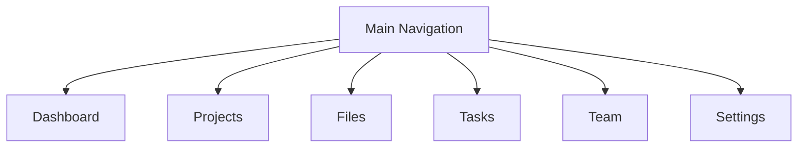
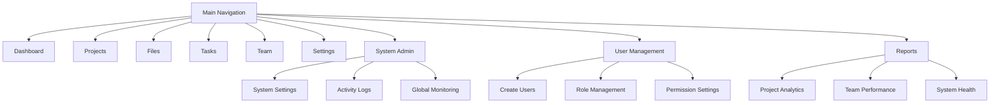
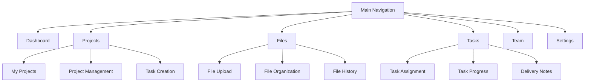
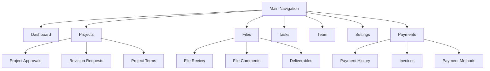
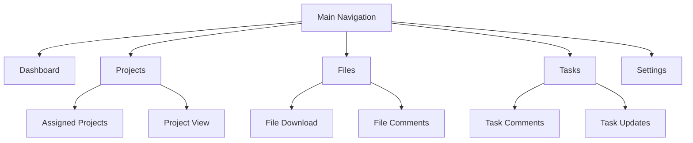

# UI Implementation for User Type-Based Changes

## Table of Contents
1. [Overview](#overview)
2. [Navigation Structure by User Type](#navigation-structure-by-user-type)
3. [Component-Level Changes](#component-level-changes)
4. [Visual Design Guidelines](#visual-design-guidelines)
5. [Implementation Strategy](#implementation-strategy)
6. [Testing Requirements](#testing-requirements)

## Overview

This document outlines the specific UI changes required to adapt the navigation, components, and overall interface based on the logged-in user type. The implementation follows the user types and permissions defined in [user-types-permissions.md](docs/user-types-permissions.md).


## Navigation Structure by User Type

### Base Navigation Structure



### User Type Specific Navigation

#### Motionify Admin Navigation


#### Motionify Team Member Navigation


#### Client Project Manager Navigation


#### Client Team Member Navigation


## Component-Level Changes

### Dashboard Components

| Component | Motionify Admin | Motionify Team | Client PM | Client Team |
|-----------|----------------|----------------|-----------|-------------|
| System Health Widget | ✅ | ❌ | ❌ | ❌ |
| Project Creation CTA | ✅ | ❌ | ❌ | ❌ |
| Team Activity Feed | ✅ | ✅ | ✅ | ✅ |
| Quick Actions Panel | ✅ | ✅ | ✅ | ❌ |
| Payment Status Widget | ❌ | ❌ | ✅ | ❌ |

### Project Detail Components

| Component | Motionify Admin | Motionify Team | Client PM | Client Team |
|-----------|----------------|----------------|-----------|-------------|
| Project Settings Edit | ✅ | ✅ | ❌ | ❌ |
| Team Assignment Panel | ✅ | ✅ | ✅ | ❌ |
| Task Creation Form | ✅ | ✅ | ❌ | ❌ |
| Approval Workflow | ❌ | ❌ | ✅ | ❌ |
| Revision Request Form | ❌ | ❌ | ✅ | ❌ |
| File Upload Zone | ✅ | ✅ | ✅ | ❌ |
| File Comment Section | ✅ | ✅ | ✅ | ✅ |

### Task Management Components

| Component | Motionify Admin | Motionify Team | Client PM | Client Team |
|-----------|----------------|----------------|-----------|-------------|
| Task Creation Button | ✅ | ✅ | ❌ | ❌ |
| Task Assignment Dropdown | ✅ | ✅ | ✅ | ❌ |
| Status Change Controls | ✅ | ✅ | ✅ | ❌ |
| Delivery Notes Editor | ✅ | ✅ | ❌ | ❌ |
| Approval Buttons | ❌ | ❌ | ✅ | ❌ |
| Comment Section | ✅ | ✅ | ✅ | ✅ |
| Follow Task Toggle | ✅ | ✅ | ✅ | ✅ |

## Visual Design Guidelines

### Color Scheme by User Type

```css
/* Motionify Admin */
.admin-badge { background-color: #1E40AF; color: white; }
.admin-accent { color: #1E40AF; }
.admin-border { border-color: #1E40AF; }

/* Motionify Team Member */
.team-badge { background-color: #16A34A; color: white; }
.team-accent { color: #16A34A; }
.team-border { border-color: #16A34A; }

/* Client Project Manager */
.client-pm-badge { background-color: #9333EA; color: white; }
.client-pm-accent { color: #9333EA; }
.client-pm-border { border-color: #9333EA; }

/* Client Team Member */
.client-badge { background-color: #3B82F6; color: white; }
.client-accent { color: #3B82F6; }
.client-border { border-color: #3B82F6; }
```

### Typography and Icons

- **Motionify Admin**: Use bold fonts with shield icons for admin-specific actions
- **Motionify Team Member**: Medium weight fonts with briefcase icons for team features
- **Client Project Manager**: Semi-bold fonts with star icons for approval actions
- **Client Team Member**: Regular fonts with user icons for collaborative features

## Implementation Strategy

### Backend Integration

1. **User Context Enhancement**
   - Extend `UserContext.tsx` to include detailed role information
   - Add permission checking utilities
   - Implement role-based data fetching

2. **API Endpoint Updates**
   - Add role parameter to relevant API calls
   - Implement permission validation middleware
   - Create role-specific data endpoints

### Frontend Implementation

1. **Navigation Component Updates**
   - Create role-based navigation configuration
   - Implement dynamic menu rendering
   - Add permission-based route guards

2. **Component Wrapping**
   - Create `WithPermission` HOC for conditional rendering
   - Implement `PermissionGate` component for UI elements
   - Add role-specific component variants

3. **State Management**
   - Extend user state with role information
   - Add permission checking selectors
   - Implement role-based data caching

### Code Examples

```typescript
// Example: Role-based navigation rendering
const renderNavigation = (userRole: UserRole) => {
  const baseNav = [
    { path: '/dashboard', label: 'Dashboard', icon: 'home' },
    { path: '/projects', label: 'Projects', icon: 'projects' },
    { path: '/files', label: 'Files', icon: 'files' },
    { path: '/tasks', label: 'Tasks', icon: 'tasks' }
  ];

  const roleSpecificNav = {
    [UserRole.SUPER_ADMIN]: [
      { path: '/admin/system', label: 'System Admin', icon: 'settings' },
      { path: '/admin/users', label: 'User Management', icon: 'users' },
      { path: '/admin/reports', label: 'Reports', icon: 'chart' }
    ],
    [UserRole.PROJECT_MANAGER]: [
      { path: '/team/management', label: 'Team Management', icon: 'team' }
    ],
    [UserRole.CLIENT_PRIMARY]: [
      { path: '/payments', label: 'Payments', icon: 'credit-card' }
    ]
  };

  return [...baseNav, ...(roleSpecificNav[userRole] || [])];
};

// Example: Permission-based component rendering
const PermissionGate = ({ children, requiredPermission }) => {
  const { user } = useUserContext();

  if (!user || !hasPermission(user, requiredPermission)) {
    return null;
  }

  return children;
};

// Example: Role-specific styling
const getRoleStyles = (userRole: UserRole) => {
  const roleStyles = {
    [UserRole.SUPER_ADMIN]: {
      badge: 'bg-blue-900 text-white',
      accent: 'text-blue-900',
      border: 'border-blue-900'
    },
    [UserRole.PROJECT_MANAGER]: {
      badge: 'bg-green-600 text-white',
      accent: 'text-green-600',
      border: 'border-green-600'
    },
    [UserRole.CLIENT_PRIMARY]: {
      badge: 'bg-purple-600 text-white',
      accent: 'text-purple-600',
      border: 'border-purple-600'
    },
    [UserRole.CLIENT]: {
      badge: 'bg-blue-500 text-white',
      accent: 'text-blue-500',
      border: 'border-blue-500'
    }
  };

  return roleStyles[userRole] || roleStyles[UserRole.CLIENT];
};
```

## Testing Requirements

### Test Coverage Matrix

| Test Type | Motionify Admin | Motionify Team | Client PM | Client Team |
|-----------|----------------|----------------|-----------|-------------|
| Navigation Rendering | ✅ | ✅ | ✅ | ✅ |
| Component Visibility | ✅ | ✅ | ✅ | ✅ |
| Permission Gates | ✅ | ✅ | ✅ | ✅ |
| Role Switching | ✅ | ✅ | ✅ | ✅ |
| UI Consistency | ✅ | ✅ | ✅ | ✅ |

### Test Scenarios

1. **Navigation Testing**
   - Verify correct menu items appear for each user type
   - Test navigation item permissions
   - Validate route access control

2. **Component Testing**
   - Test conditional rendering of components
   - Verify permission gate functionality
   - Validate role-specific component behavior

34. **Integration Testing**
   - Test role switching scenarios
   - Validate permission inheritance
   - Test edge cases and permission conflicts

## Implementation Checklist

- [ ] Extend user context with role information
- [ ] Create role-based navigation configuration
- [ ] Implement permission checking utilities
- [ ] Develop role-specific component variants
- [ ] Implement permission-based UI rendering
- [ ] Create comprehensive test suite
- [ ] Document implementation details
- [ ] Implement role-based analytics tracking

## Next Steps

1. **Backend Preparation**
   - Ensure user role data is available in API responses
   - Implement permission validation endpoints
   - Create role-based data fetching endpoints

2. **Frontend Implementation**
   - Update navigation components with role logic
   - Implement permission gates throughout UI

3. **Testing and Validation**
   - Create test cases for all user types
   - Validate permission scenarios

4. **Deployment and Monitoring**
   - Gradual rollout with feature flags
   - Monitor user feedback and analytics
   - Iterate based on usage patterns

This implementation should be integrated with the existing authentication system and leverage the current component architecture while extending it with the role-based functionality outlined in this document.